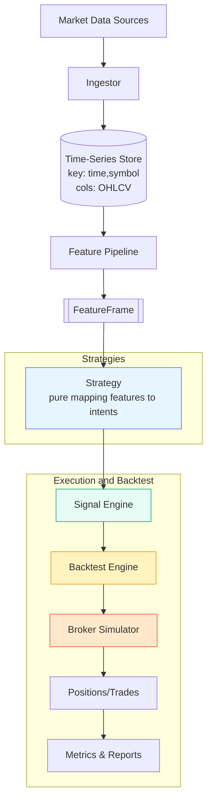

# Quant System: Strategy-Independent Backtesting and Signal Generation

## Overview
A modular system for backtesting and live signal generation. Strategies are pure mappers from features to trade intents; engines consume intents without changing. Data is keyed by (time, symbol) with base OHLCV and derived features.

## Core Principles
- Decoupled: Strategy code does not modify engines.
- Feature-first: Strategies operate on a unified feature frame.
- Deterministic: Same features + params → same intents.
- Pluggable: Swap data, features, strategies, or engines independently.

## Data Model
- Primary key: time, symbol
- Base features: open, high, low, close, volume
- Derived features: computed columns (e.g., returns, MA, RSI)
- Signal features: buy, sell, position
- FeatureFrame: tabular, aligned, time-indexed per symbol

## Invariance Guarantee
- Changing a strategy only changes the mapping from features to intents.
- Engines (signal, backtest, broker sim) are unaffected and require no code changes.
- New features or data sources remain compatible as long as they conform to the FeatureFrame schema.